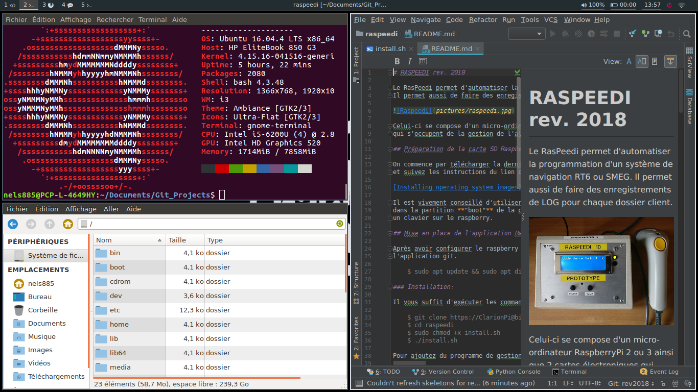

# A propos

Ce dépôt est un fork de celui de Grafikart pour la configuration de l'environnement i3wm sous Ubuntu 18.04 LTS pour mon Laptop HP ProBook G3 530.
Celui-ci comporte quelques différences au niveau visuel ainsi qu'au niveau des logiciels (terminal termite ou terminator, pycharm pour Python, etc...).

[](screenshots/screenshot.png)

La liste des paquets installés sur ma machine sont disponibles dans le fichier package.list. Les paquets AUR sont en fin de liste

# Installation i3wm sous Ubuntu 18.04 LTS

```
$ sudo apt update && sudo apt dist-upgrade
$ sudo apt install i3 thunar rofi compton lxappearance feh inxi fonts-font-awesome
```

* Installation du Fork de i3 (version 4.15.0.1):
```
$ git clone https://www.github.com/Airblader/i3 i3-gaps
$ cd i3-gaps/
$ autoreconf --force --install
$ rm -rf build/
$ mkdir -p build && cd build
$ ../configure --prefix=/usr --sysconfdir=/etc --disable-sanitizers
$ make
$ sudo make install
```

* Ajout de polybar Ubuntu 16.04:
```
$ wget -q -O - http://archive.getdeb.net/getdeb-archive.key | sudo apt-key add -
$ sudo sh -c 'echo "deb http://archive.getdeb.net/ubuntu xenial-getdeb apps" >> /etc/apt/sources.list.d/getdeb.list'
$ sudo apt update
$ sudo apt install polybar
$ mkdir ~/.config/polybar
$ gzip -dc /usr/share/doc/polybar/config.gz > ~/.config/polybar/config

```

* Ajout de polybar Ubuntu 18.04:
```
$ sudo apt-get install libxcb-ewmh-dev
$ sudo apt install python-xcbgen
$ git clone --branch 3.2 --recursive https://github.com/jaagr/polybar
$ mkdir polybar/build
$ cd polybar/build
$ cmake ..
$ sudo make install
```

* Recharger les couleurs de Xresources
```
$ xrdb .Xresources 
```

* Réglage luminosité:
```
$ git clone https://github.com/haikarainen/light.git
$ cd light
$ sudo apt install help2man
$ sudo make && sudo make install
```

* Copie des fichiers configurations pour i3wm dans le dossier .config:
```
$ cp -R config/* ~/.config
```

# Trucs & Astuces

## Thème Flatabulous

```
$ sudo add-apt-repository ppa:noobslab/themes
$ sudo apt update
$ sudo apt-get install flatabulous-theme
$ sudo add-apt-repository ppa:noobslab/icons
$ sudo apt update
$ sudo apt-get install ultra-flat-icons
```

## Installation Neofetch

```
$ sudo add-apt-repository ppa:dawidd0811/neofetch
$ sudo apt update
$ sudo apt install neofetch
```

## Outils de développements

* Pycharm Professional:
```
$ sudo snap install pycharm-professional --classic
```

* sublime-text 3:
```
$ wget -qO - https://download.sublimetext.com/sublimehq-pub.gpg | sudo apt-key add -
$ sudo apt-get install apt-transport-https
$ echo "deb https://download.sublimetext.com/ apt/stable/" | sudo tee /etc/apt/sources.list.d/sublime-text.list
$ sudo apt update
$ sudo apt install sublime-text
```

* PAC manager:
```
$ wget http://sourceforge.net/projects/pacmanager/files/pac-4.0/pac-4.5.5.7-all.deb
$ sudo dpkg -i pac-4.5.5.7-all.deb 
$ sudo apt install -f
```

## Trouver le process qui utilise un port

```
sudo netstat -nlp | grep :80
```